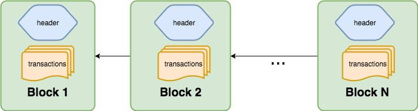
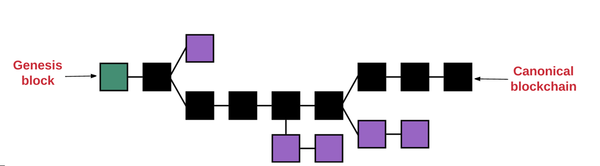
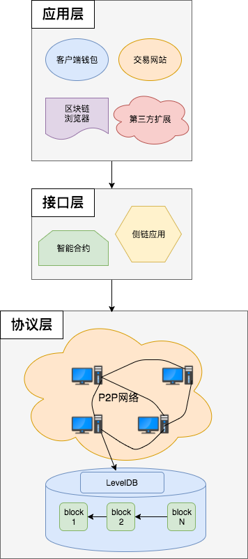
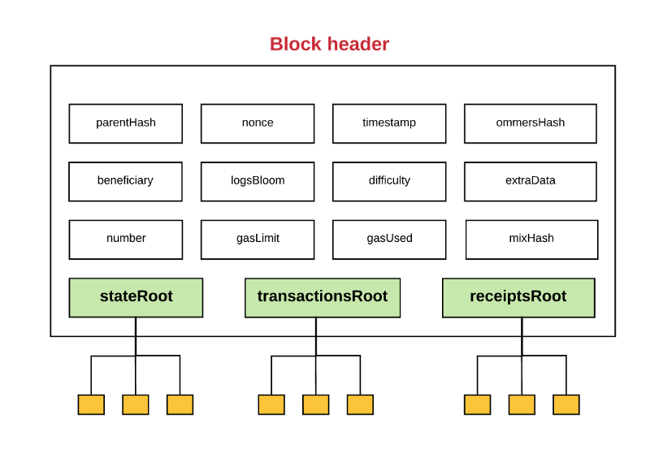
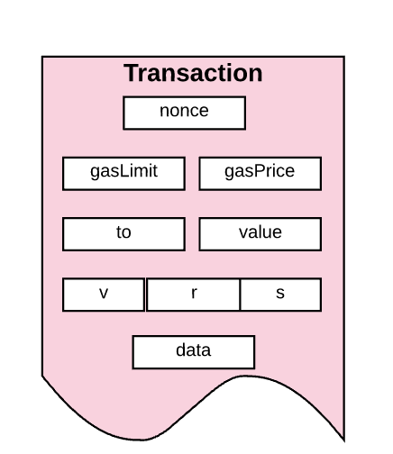

Go-ethereum 디자인 아이디어 및 모듈 구성
Ethereum의 목표는 블록 체인 기술을 기반으로 스마트 계약을 실행하기위한 분산 플랫폼을 만드는 것입니다.

I. 블록 체인 기술
Blockchain은 분산 디지털 청구 기술로서, 서로 신뢰하지 않는 노드가 블록 체인 데이터를 유지 관리하며 각 노드는 전체 레코드를 복사합니다.

II. 이더리움 코어 개념
EVM : Ethereum 가상 머신, 경량 가상 머신 환경, Ethereum 스마트 계약 운영 환경.
Account : 계약 계정과 외부 계정의 두 가지 유형의 계정이 있습니다. 계약 계정은 주로 실행 된 계약 코드를 저장합니다. 외부 계정에는 이더넷 동전이 저장되며 특정 공통 키에 해당합니다.
Transaction : Ethereum 네트워크에서의 트랜잭션, Ethereum 또는이 스마트 계약 매개 변수를 포함하여 한 계정에서 다른 계정으로의 메시지.
Gas : Ethereum 네트워크에서 작동하는 연료는 실행 된 모든 현명한 계약에 대해 일정량의 연료를 소비합니다.
Mine : 네트워크의 안전한 작동을 보장하기 위해 작업로드 증명 알고리즘을 통해 광산, Ethereum 네트워크.
P2P 네트워크 : Ethereum 분산 네트워크의 모든 노드는 동일한 상태이며 중앙 서버가 없습니다.

III. Ethereum 모델
Ethereum은 본질적으로 트랜잭션 기반의 상태 머신입니다. Ethereum의 상태에는 수백만 개의 트랜잭션이 있으며,이 트랜잭션은 블록으로 패키지화됩니다. 각 블록은 이전과 동일합니다. 블록은 서로 링크되어 블록 체인이라는 역방향 연결 목록을 형성합니다. 블록 체인 기반으로 Ethereum을 생성하는 정보 계약이 추가되었습니다.



트랜잭션을 효과적이라고 간주하기 위해서는 확인 프로세스를 거쳐야합니다.이 프로세스는 마이닝입니다. 모든 이더넷 네트워크에서 광부 광장이 확인을 완료하기 위해 블록이 효과적인 것으로 간주되는 경우, 생성하고 블록을 확인하기 위해 시도하고 가장 빠른 수 있습니다, 그것은 백본에 추가됩니다 백본 네트워크는 이더넷 광장입니다 가장 긴 체인. 여러 광부는 시간이 좀 걸릴 것 네트워크의 확산 블록, 블록 포장이있는 경우, 그것은 필연적으로 여러 경로, 소위 분기로 이어질 것입니다. 체인 복수 방지하기 위해, 에테르 스퀘어 프로토콜 GHOST (욕심쟁이 무거운 관측 하위 트리), 하나 개의 경로를 선택하도록 계산 완료된 사용한 큰 블록 수는 경로 길어 힘 마이닝 소모량 계산은 자세히 설명 더. 새로운 블록이 일정량의 에테르 동전을 받게된다는 것이 성공적으로 확인 되었기 때문에 주 체인을 선택하는 것이 경제학과 게임 이론의 관점에서 최적입니다.



IV. Ethereum 아키텍처
Ethereum의 아키텍처 설계는 프로토콜 레이어, 인터페이스 레이어 및 애플리케이션 레이어의 세 가지 레벨로 간단하게 나눌 수 있습니다. 프로토콜 계층은 네트워크 계층과 저장 계층으로 더 나눌 수 있습니다.



기술적 인 관점에서, 프로토콜 계층은 주로 P2P 네트워크 통신, 분산 알고리즘, 암호 서명 및 데이터 저장 기술을 포함합니다. 데이터 저장소의 하단에서 Bitcoin과 Ethereum은 Google의 공개 소스 LevelDB 데이터베이스를 사용합니다.

인터페이스 계층 프로토콜 층은 완전히 분산 된 저장 서비스, 기계 학습, 및 다른 것들을 포함하는, 무제한 다양한 응용 계층 서비스 블록 사슬의 개발을 위해, 트랜잭션 프로토콜 계층과 상호 작용에 더하여, 분리 하였다.

응용 프로그램 계층은 주로 블록 체인 자체의 특성에서 시작하여 타사 조직을 참조하지 않고 분산되고 비 해독 가능하며 안전하고 신뢰할 수있는 시나리오를 제공합니다. 주로 금융 서비스, 신용 및 소유권 관리, 자원 공유, 투자 관리, 사물과 공급망의 인터넷을 포함합니다.

V. Ethereum 핵심 데이터 구조
Block은 Ethereum의 핵심 데이터 구조 중 하나이며, Block은 Header와 Body의 두 부분으로 구성됩니다.



2. Blockchain 및 HeaderChain, Blockchain은 모든 블록을 관리하고 단방향 링크 목록을 만듭니다. Headerchain은 모든 Headers를 관리하고 단방향 연결 목록을 구성합니다. Headerchain은 Blockchain의 일부입니다.
3. 거래는 본문의 중요한 데이터 구조입니다. 거래는 외부 소유 계정에 의해 생성 된 후 블록 체인에 제출되는 일련의 암호화 서명입니다.



이진 트리의 노드의 집합으로 구성되어 있습니다 
4. 에테르 광장 데이터베이스 시스템 -Merkle - 패트리샤 트리는 (MPT)은, 리프 노드의 트리 끝이 데이터 소스의 숫자를 포함, 부모 노드는 두 자식 노드의 해시 값까지입니다 루트 노드.


VI. go-ethereum 디렉토리 구조
```
| --- accounts              Ethereum 계정 관리 계정
| --- bmt                   Bmt 바이너리 Merkle-Patricia Trie 구현
| --- build                 빌드는 주로 컴파일되고 일부 스크립트 및 구성을 구축합니다.
| --- cmd                   명령 줄 도구
|       |--- abigen         계약 인터페이스 생성 도구
|       |--- bootnode       bootnode에 의한 네트워크 발견을위한 노드
|       |--- evm            Ethereum 가상 머신
|       |--- faucet         수도꼭지
|       |--- geth           Ethere 명령 행 클라이언트
|       |--- p2psim         p2psim은 http API를 시뮬레이트하는 도구를 제공합니다.
|       |--- puppeth        새로운 에테르 네트워크 생성 마법사
|       |--- rlpdump        rlpdump는 RLP 데이터의 형식화 된 출력을 제공합니다.
|       |--- swarm          swarm 네트워크 액세스 포인트
|       |--- util           공용 구성 요소
|       |--- wnode          이것은 간단한 Whisper 노드입니다. 독립 실행 형 부트 노드로 사용할 수 있습니다. 또한 다양한 테스트 및 진단 목적으로 사용될 수 있습니다.
| --- common                common은 몇 가지 공통 유틸리티 클래스를 제공합니다.
| --- consensus             ethens consensus 알고리즘, ethhash, clique 포함
| --- core                  Ethereum의 핵심 데이터 구조 및 알고리즘 (가상 머신, 상태, 블록 체인, 블룸 필터)
| --- crypto                암호 암호화, 디지털 서명 및 해시 알고리즘
| --- eth                   eth는 Ethereum 계약을 이행합니다.
| --- ethclient             Ethereum RPC 클라이언트
| --- ethdb                 eth 데이터베이스, 주로 LevelDB 및 해당 인터페이스
| --- event                 이벤트 실시간 이벤트 처리
| --- light                 Ethereum 경량 클라이언트를위한 주문형 검색을 구현합니다.
| --- metrics               metrics은 디스크 카운터를 제공합니다.
| --- miner                 mine and consensus 알고리즘
| --- mobile                모바일에서 사용되는 일부 워퍼
| --- node                  Ethereum의 여러 유형의 노드
| --- p2p                   Ethereum P2P 네트워크 프로토콜
| --- rlp                   Ethereum 직렬화 및 직렬화 해제 처리
| --- rpc                   원격 메소드 호출
| --- swarm                 swarm 네트워크 처리
| --- trie                  ethereum 중요한 데이터 구조 MPT 구현
| --- whisper               whisper 노드의 프로토콜
```

VII. 정보

[https://github.com/toints/Ethereum-Source-Analysis](https://github.com/toints/Ethereum-Source-Analysis/blob/master/0.1%20go-ethereum%E7%9A%84%E8%AE%BE%E8%AE%A1%E6%80%9D%E8%B7%AF%E5%8F%8A%E6%A8%A1%E5%9D%97%E7%BB%84%E7%BB%87%E5%BD%A2%E5%BC%8F.md) 중국어를 구글 번역기를 사용해 한글로 번역한 자료입니다.